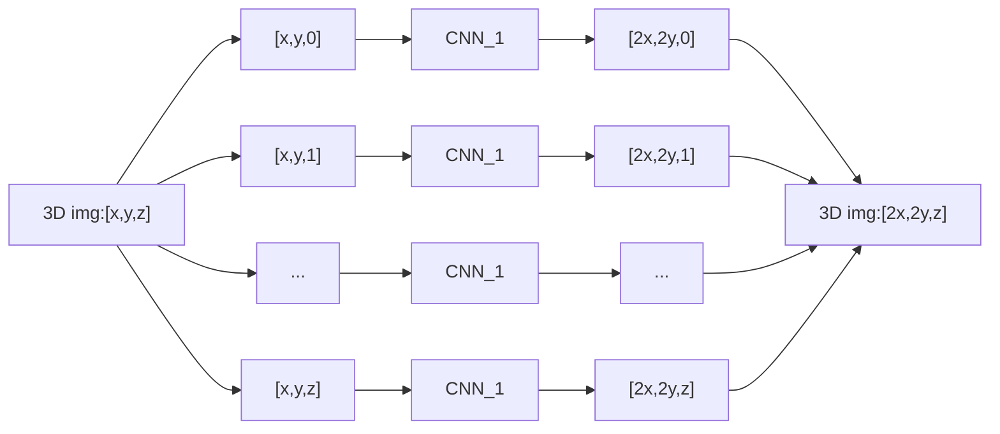
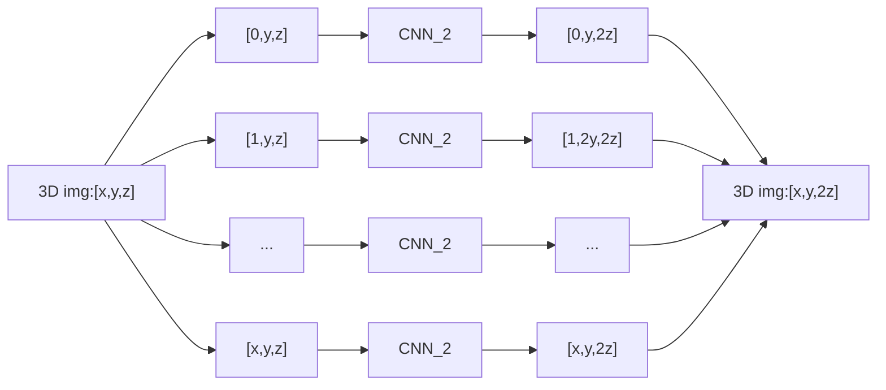
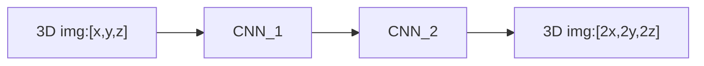

# Convolutional Neural Networks with Intermediate Loss for 3D Super-Resolution of CT and MRI Scans
```
@misc{Georgescu-2020,
    title={Convolutional Neural Networks with Intermediate Loss for 3D Super-Resolution of CT and MRI Scans},
    author={Mariana-Iuliana Georgescu and Radu Tudor Ionescu and Nicolae Verga},
    year={2020}, 
    book={IEEE Access}
}
```
The citation for the paper is found above, with the offical github repository found here: https://github.com/lilygeorgescu/3d-super-res-cnn

### Summary: 
This paper explores using two seperate 2D SR Convolutional Neural Network (CNN) models to accomplish 3D SR. Effectively, if you have a 3D image with axes [x,y,z] and you want to double its size, you first have a model (`CNN_1`) double the height and width of slices along a given axis by treating each slice as a 2D image:



Then you use a second model (`CNN_2`) which only doubles the remaining dimension of the 3D image by taking 2D slices from a different orientation:



By combining these two methods, you can effectively do 3D SR using 2D convolutional layers with fewer weights (and thus less training time and resources) than 3D convolutional layers.



## File list:
```
./main.ipynb : Jupyter notebook used in the creation and training of this SR model type

./CNNIL_save_network1_39.p : Saved weights for the first CNN block

./CNNIL_save_network2_39.p : Saved weights for the second CNN block

```
