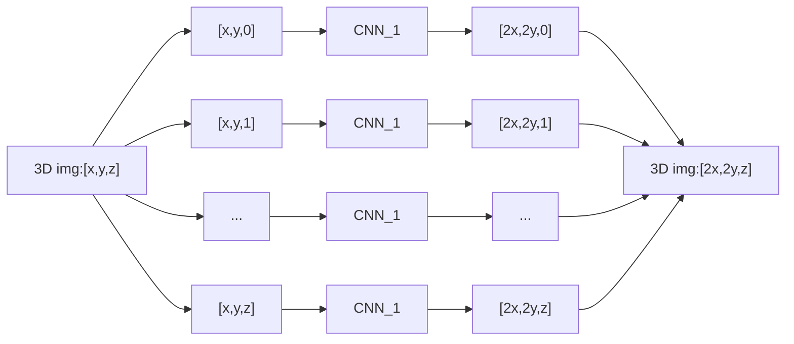
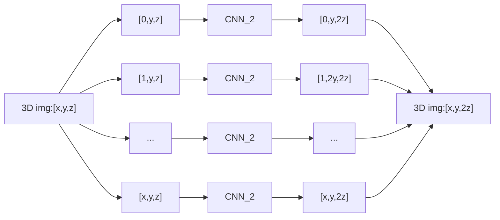
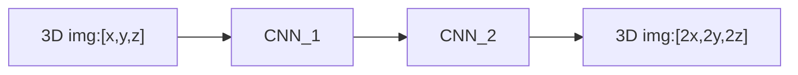
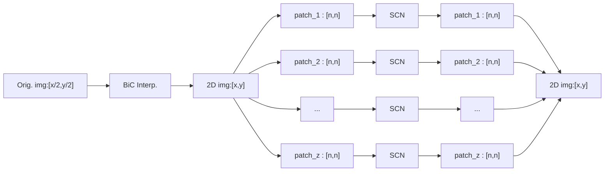

# Super-Resolution Paper Replication

This repository is meant to contain my experimentation with (and replication of) the different Super-Resolution (SR) papers and concepts that I come across. Each paper will be given its own folder, with a `README.md` for each which further explains its contents. Please see the end of this `README` for the License Agreement.


## General Repo-Specific Custom Code
The `gen_utils` directory contains the classes and functions that I have created that perform functions that are used across the different SR implementations. These are mainly related to the loading/processing/sampling of input `.nii`, `.png`, and `.dcm` files and may be imported in the different notebooks.

## 1. Convolutional Neural Networks with Intermediate Loss for 3D Super-Resolution of CT and MRI Scans
```
@misc{Georgescu-2020,
    title={Convolutional Neural Networks with Intermediate Loss for 3D Super-Resolution of CT and MRI Scans},
    author={Mariana-Iuliana Georgescu and Radu Tudor Ionescu and Nicolae Verga},
    year={2020}, 
    book={IEEE Access}
}
```
Contained in the `CNNIL` directory. The citation for the paper is found above, with the offical github repository found here: https://github.com/lilygeorgescu/3d-super-res-cnn

### Summary: 
This paper explores using two seperate 2D SR Convolutional Neural Network (CNN) models to accomplish 3D SR. Effectively, if you have a 3D image with axes [x,y,z] and you want to double its size, you first have a model (`CNN_1`) double the height and width of slices along a given axis by treating each slice as a 2D image:




Then you use a second model (`CNN_2`) which only doubles the remaining dimension of the 3D image by taking 2D slices from a different orientation:



By combining these two methods, you can effectively do 3D SR using 2D convolutional layers with fewer weights (and thus less training time and resources) than 3D convolutional layers.





## 2. Robust Single Image Super-Resolution via Deep Networks With Sparse Prior
```
@ARTICLE{7466062,
  author={Liu, Ding and Wang, Zhaowen and Wen, Bihan and Yang, Jianchao and Han, Wei and Huang, Thomas S.},
  journal={IEEE Transactions on Image Processing}, 
  title={Robust Single Image Super-Resolution via Deep Networks With Sparse Prior}, 
  year={2016},
  volume={25},
  number={7},
  pages={3194-3207},
  doi={10.1109/TIP.2016.2564643}}
```

Contained in the `SCN` directory. The citation for the paper is found above, with the offical github repository found here: https://github.com/huangzehao/SCN_Matlab

### Summary:
This paper explores using samples from a single 2D image (in the form of patches) and treating them as seperate images for the sake of training a model (`SCN`). Using the assumption that natural images can be sparsely represented, the model trained seeks to find a sparse representation of the patches for use in interpolation (creating the SR image).

The model functions by taking a 2D image which has had it's resolution increased through the use of bicubic interpolation (creating an image of dimensions `x-by-y`) and breaking it into a series of `n-by-n` 2D patches. Each patch is then run through the model and the resulting output patches are reassembled into back into an image. This resulting image idealy has information added.


This model can also be trained for differnet changes in magintude of resolution (`x3`, `x4`, etc.), but my implementation only deals with `x2` as I "got the picture" after that.


# License agreement
Attribution-NonCommercial-ShareAlike 4.0 International (CC BY-NC-SA 4.0) 
(https://creativecommons.org/licenses/by-nc-sa/4.0/)

You are free to:

  #### Share — copy and redistribute the material in any medium or format

  #### Adapt — remix, transform, and build upon the material

Under the following terms:
 #### Attribution — You must give appropriate credit, provide a link to the license, and indicate if changes were made. You may do so in any reasonable manner, but not in any way that suggests the licensor endorses you or your use.

 #### NonCommercial — You may not use the material for commercial purposes.

 #### ShareAlike — If you remix, transform, or build upon the material, you must distribute your contributions under the same license as the original.

