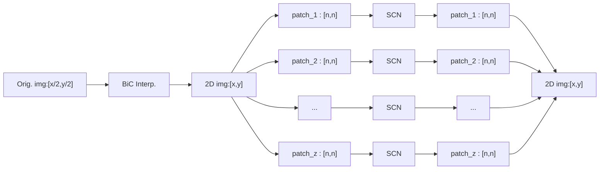

# Robust Single Image Super-Resolution via Deep Networks With Sparse Prior
```
@ARTICLE{7466062,
  author={Liu, Ding and Wang, Zhaowen and Wen, Bihan and Yang, Jianchao and Han, Wei and Huang, Thomas S.},
  journal={IEEE Transactions on Image Processing}, 
  title={Robust Single Image Super-Resolution via Deep Networks With Sparse Prior}, 
  year={2016},
  volume={25},
  number={7},
  pages={3194-3207},
  doi={10.1109/TIP.2016.2564643}}
```

 The citation for the paper is found above, with the offical github repository found here: https://github.com/huangzehao/SCN_Matlab

### Summary:
This paper explores using samples from a single 2D image (in the form of patches) and treating them as seperate images for the sake of training a model (`SCN`). Using the assumption that natural images can be sparsely represented, the model trained seeks to find a sparse representation of the patches for use in interpolation (creating the SR image).

The model functions by taking a 2D image which has had it's resolution increased through the use of bicubic interpolation (creating an image of dimensions `x-by-y`) and breaking it into a series of `n-by-n` 2D patches. Each patch is then run through the model and the resulting output patches are reassembled into back into an image. This resulting image idealy has information added.


This model can also be trained for differnet changes in magintude of resolution (`x3`, `x4`, etc.), but my implementation only deals with `x2`.

### Class report:
For a more detailed description on what is done in this model, read the report I wrote for class in the `supp_material` directory: `lawrence_sparse.pdf`


## File list:
```
./supp_material
    /lawrence_sparse.pdf
    /SCN_BSD_final.p : file containing weights for BSD100-trained model, loaded in the MRI_SCN.ipynb when instantiating the BSD100-trained model
    /MRI_run_SGD_v100_57.p : file containing weights for MRI-trained model, loaded in the MRI_SCN.ipynb when instantiating the MRI-trained model
    /test_images.zip : zipped MRI images for testing the MRI-trained model

./gen_SCN.ipynb : notebook for a generalized SCN model, which accepts a wide variety of inputs

./image_generation.ipynb : notebook for generating training and testing image patches from both pngs and nii files

./MRI_SCN.ipynb : notebook containing both the BSD100 trained model and the MRI-trained model, also includes the training and testing functions
```